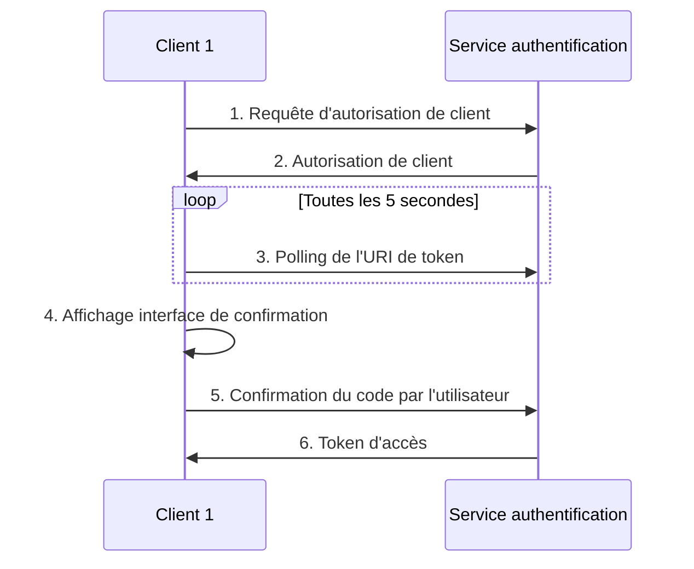

# Authentification OAuth2

Description des flux d'authentification.

## Device Authentication Flow

Permet à un utilisateur d’authentifier un client sans que celui-ci n’ait besoin d’une URL de callback (pas de nécessité de serveur web).

Le client doit être en capacité :
- d’ouvrir un navigateur embarqué ou d’ouvrir le navigateur sur le terminal de l’utilisateur
- de réaliser un polling HTTP sur un endpoint durant la phase de validation par l’utilisateur

### Fonctionnement

**1.** Le client interroge une URL chargée de contrôler le client ID et de retourner des paramètres pour le contrôle du device.
  - URL : `[API_URL]/oauth/authorize_device`
  - Paramètre nécessaire : `client_id`

**2.** Le serveur d’authentification retourne les infos suivantes : `device_code`, `user_code`, `verification_uri`, `expires_in`, `interval`

**3.** Le client effectue en parallèle :
  - un polling à intervalle indiquée par le retour de requête (attribut `interval`) sur l’URL de token (`[API_URL]/oauth/token`)
  - un affichage de page de navigateur correspondant à l’URL `verification_uri`

**4.** Le serveur d’authentification retourne le token d’accès sur le token endpoint (`[API_URL]/oauth/token`) lorsque l’utilisateur confirme le code embarqué dans l’URL `verification_uri` depuis la page de navigateur

### Schéma

Schéma de séquence du device flow :



### Utilisation

#### 1. Requête d'autorisation de client

|Requête|URL|Paramètres|
|-------|---|----------|
|POST|`[API_URL]/oauth/authorize_device`|`client_id`|

#### 2. Autorisation de client

|Attribut|Type|Description|
|--------|----|-----------|
|device_code|`Str`|Code d'authentification du client nécessaire pour la requête 3.|
|user_code|`Str`|Code que l'utilisateur doit valider pour s'authentifier|
|verification_uri|`Str`|URL de l'interface de validation de l'authentification (sans le code)|
|verification_uri_complete|`Str`|URL de l'interface de validation de l'authentification (avec le code en paramètre)|
|expires_in|`Int`|Durée de validité de la requête d'autorisation|
|interval|`Int`|Intervale autorisée pour effectuer le polling|

#### 3. Polling de l'URI de token

Effectué sur une intervale correspondant à la valeur `interval` de la requête ***2. Autorisation de client***.

Expire au bout de `expires_in` secondes.

<table>
  <thead>
    <tr>
      <th>Requête</th>
      <th>URL</th>
      <th>Paramètre</th>
      <th>Valeur</th>
    </tr>
  </thead>
  <tbody>
    <tr>
      <td rowspan="3">POST</td>
      <td rowspan="3">`[API_URL]/oauth/token`</td>
      <td>`grant_type`</td>
      <td>`urn:ietf:params:oauth:grant-type:device_code`</td>
    </tr>
    <tr>
      <td>`device_code`</td>
      <td>`[REDACTED]`</td>
    </tr>
    <tr>
      <td>`client_id`</td>
      <td>`[REDACTED]`</td>
    </tr>
  </tbody>
</table>

##### Réponses du serveur :

- Polling en attente de la confirmation :
```js
{ "error": "authorization_pending" }
```

- Polling trop fréquent vis à vis de l'intervale :
```js
{ "error": "slow_down" }
```

- Polling après authentification avec succès :
```js
{
  "access_token": "[REDACTED]",
  "token_type": "Bearer",
  "expires_in": 7200,
  "refresh_token": "[REDACTED]",
  "scope": "read",
  "created_at": 1707128830
}
```

#### 4. Affichage interface de confirmation

Ouverture de l'interface web correspondant à l'URL `verification_uri_complete` (avec le `user_code` pré-rempli) ou `verification_uri` (sans code pré-rempli - nécessaire de le fournir à l'utilisateur pour réaliser l'authentification).

#### 5. Confirmation du code par l'utilisateur

Action menée par l'utilisateur dans l'interface web (clic sur le bouton de validation).

#### 6. Token d'accès

|Attribut|Type|Description|
|--------|----|-----------|
|access_token|`Str`|Token d'accès utilisable pour récupérer les informations de l'utilisateur via l'API|
|token_type|`Str`|Bearer|
|expires_in|`Str`|Durée de validité du token (7200 secondes)|
|refresh_token|`Str`|Refrensh token utilisable pour bypasser le device flow|
|scope|`Int`|Champ d'application|
|created_at|`Int`|Date timestamp de création du token|

#### 7. Rafraîchir un token d'accès (optionnel)

<table>
  <thead>
    <tr>
      <th>Requête</th>
      <th>URL</th>
      <th>Paramètre</th>
      <th>Valeur</th>
    </tr>
  </thead>
  <tbody>
    <tr>
      <td rowspan="3">POST</td>
      <td rowspan="3">`/oauth/token`</td>
      <td>`grant_type`</td>
      <td>`refresh_token`</td>
    </tr>
    <tr>
      <td>`refresh_token`</td>
      <td>`[REDACTED]`</td>
    </tr>
    <tr>
      <td>`client_id`</td>
      <td>`[REDACTED]`</td>
    </tr>
  </tbody>
</table>


## Accès à l'API

### Accès aux informations utilisateur :

|Requête|URL|Paramètre|
|-------|---|---------|
|GET|`[API_URL]/api/v1/me`|authorization: Bearer token|

```js title="Exemple de retour"
{
  "user": {
    "id": 10,
    "firstname": "John",
    "lastname": "Doe",
    "email": "johndoe@localhost.com",
    "created_at": "2024-02-13T09:00:00.389Z"
  }
}
```
