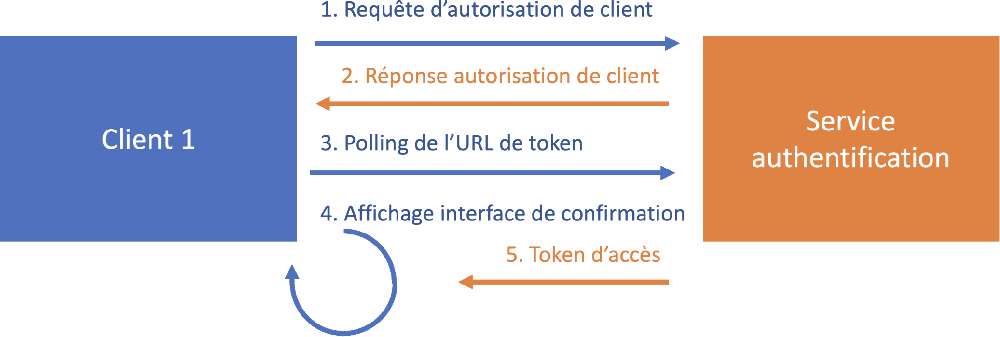

# Authentification OAuth2

Description des flux d'authentification.

## Device Authentication Flow

Permet à un utilisateur d’authentifier un client sans que celui-ci n’ait besoin d’une URL de callback (pas de nécessité de serveur web).

Le client doit être en capacité :
- d’ouvrir un navigateur embarqué ou d’ouvrir le navigateur sur le terminal de l’utilisateur
- de réaliser un polling HTTP sur un endpoint durant la phase de validation par l’utilisateur

### Fonctionnement

**1.** Le client interroge une URL chargée de contrôler le client ID et de retourner des paramètres pour le contrôle du device.
  - URL : `/oauth/authorize_device`
  - Paramètre nécessaire : `client_id`

**2.** Le serveur d’authentification retourne les infos suivantes : `device_code`, `user_code`, `verification_uri`, `expires_in`, `interval`

**3.** Le client effectue en parallèle :
  - un polling à intervalle indiquée par le retour de requête (attribut `interval`) sur l’URL de token (`/oauth/token`)
  - un affichage de page de navigateur correspondant à l’URL `verification_uri`

**4.** Le serveur d’authentification retourne le token d’accès sur le token endpoint (`/oauth/token`) lorsque l’utilisateur confirme le code embarqué dans l’URL `verification_uri` depuis la page de navigateur

### Schéma



## Accès à l'API

### Accès aux informations utilisateur :

|Requête|URL|Paramètre|
|-------|---|---------|
|GET|`/api/v1/me.json`|authorization: Bearer token|

```js title="Exemple de retour"
{
  "id": 1,
  "email": "john.doe@example.com",
  "firstname": "John",
  "lastname": "Doe",
  "created_at": "2023-11-06T15:49:07.837Z",
  "updated_at": "2023-12-07T09:13:02.592Z"
}
```

